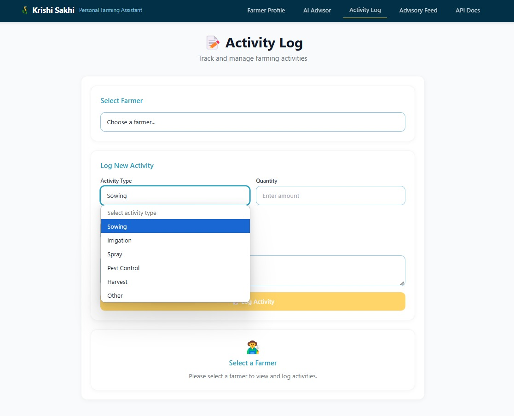
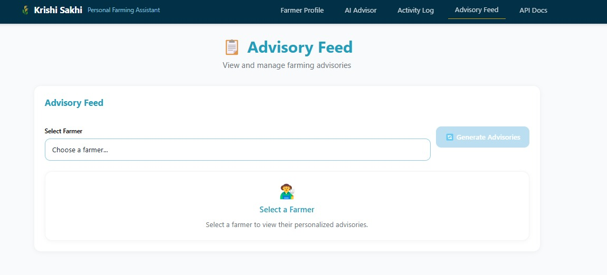

# 🌾 Krishi Sakhi – AI-Powered Personal Farming Assistant


**Krishi Sakhi** is a modern farming assistant that helps farmers manage their activities, get personalized AI-driven advisories, track weather forecasts, and access government schemes — all in one place.  
Built with **FastAPI (backend)** and **Next.js + Tailwind (frontend)** for speed, scalability, and a seamless user experience.  

---

## ✨ Features

- 📋 **Farmer Profile Management** – Manage farmer details, land size, crops, soil type, and irrigation methods.  
- 📑 **Activity Log** – Record and track farming activities such as sowing, irrigation, spraying, pest control, and harvest.  
- 🤖 **AI Advisor** – Get personalized recommendations powered by AI.  
- 🌦 **Weather Advisory** – Access real-time weather forecasts for location-based decision-making.  
- 📢 **Advisory Feed** – Generate and view tailored farming advisories.  
- 🏛 **Government Schemes** – Stay updated on available schemes and benefits.  

---

## 🖥️ Screenshots

### 1. Farmer Profile  


### 2. AI Advisor  


### 3. Activity Log  


### 4. Advisory Feed  


---

## 🛠️ Tech Stack

**Frontend:**  
- [Next.js](https://nextjs.org/)  
- [Tailwind CSS](https://tailwindcss.com/)  

**Backend:**  
- [FastAPI](https://fastapi.tiangolo.com/)  
- [SQLAlchemy](https://www.sqlalchemy.org/) + Alembic  
- [SQLite / PostgreSQL]  

**Infrastructure:**  
- Docker + Docker Compose  
- GitHub Actions (CI/CD)  

**AI/ML (Pluggable):**  
- Ollama AI for smart advisories  

---

## 🚀 Quick Start

### Prerequisites
- Python 3.12+  
- Node.js 20+  
- (Optional) Docker & Docker Compose  

### 1. Clone the repository
```bash
git clone https://github.com/Chaitanaya25/Krishi-Sakhi.git
cd Krishi-Sakhi
